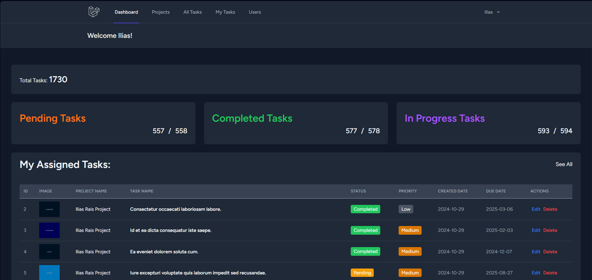
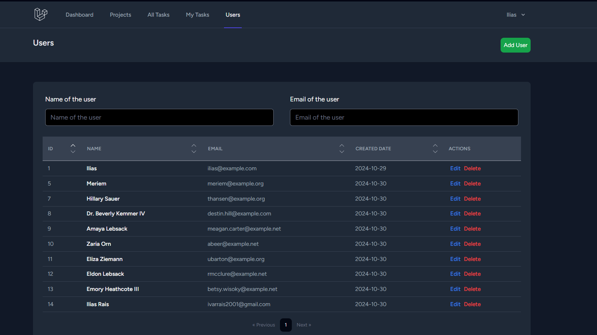
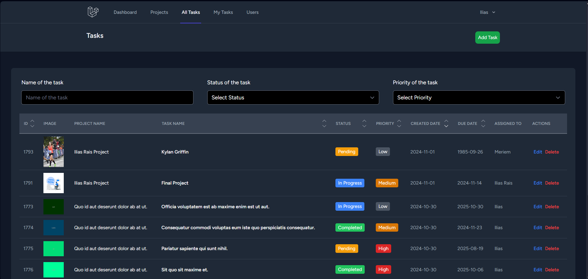
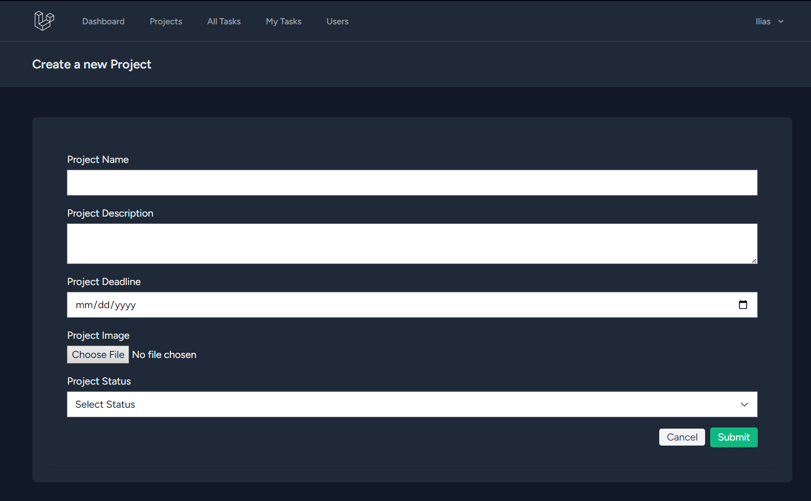
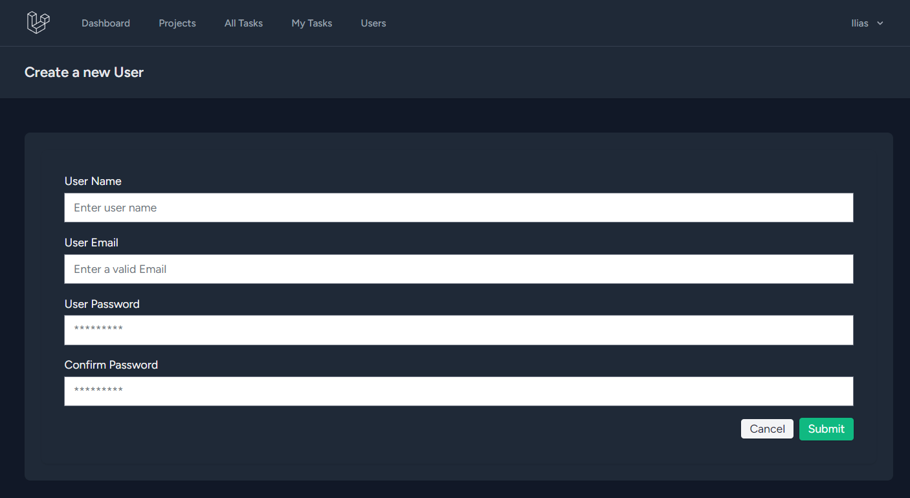
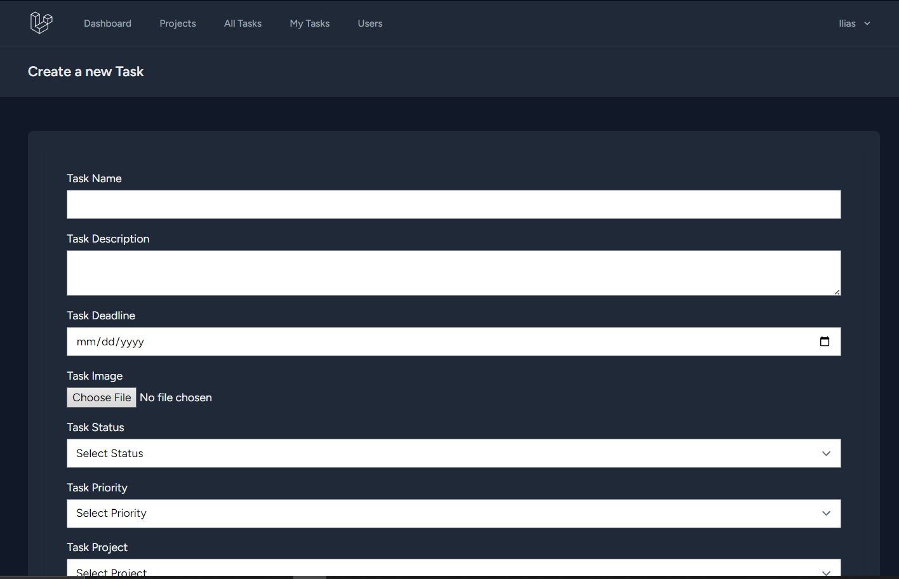

# Task Management System



A **Task Management System** built with **Laravel**, **Inertia.js**, and **Tailwind CSS**. This project is designed to help manage and track tasks efficiently, with a dashboard view displaying metrics like total tasks, pending tasks, completed tasks, and in-progress tasks. It also includes an overview of assigned tasks with relevant details.

## Features

- **User Authentication**: Secure login and registration system.
- **Dashboard Overview**: Quick access to the summary of tasks, including pending, completed, and in-progress tasks.
- **Task Management**: CRUD operations for tasks with fields like priority, status, due date, and project association.
- **User Roles**: Support for multiple roles with role-based permissions.
- **Task Assignment**: Assign tasks to users with visibility into their assigned tasks.
- **Statistics**: Real-time data on task counts for each status type.
- **Responsive Design**: Optimized for both desktop and mobile views.
- **Modern UI**: Clean and user-friendly interface styled with Tailwind CSS.

## Technologies Used

- **Backend**: [Laravel](https://laravel.com/) - A PHP framework for web artisans.
- **Frontend**: [Inertia.js](https://inertiajs.com/) - The modern monolithic approach, combining Vue.js and Laravel.
- **Styling**: [Tailwind CSS](https://tailwindcss.com/) - A utility-first CSS framework for rapid UI development.
- **Database**: SQLite (or any preferred database compatible with Laravel).

## Installation

### Prerequisites
- PHP 8.x
- Composer
- Node.js & npm
- SQLite or another database supported by Laravel

### Setup Instructions

1. **Clone the Repository**

   ```bash
   git clone https://github.com/artfull-boy/Laravel-Task-Manager.git
   cd Laravel_Inertia
   ```

2. **Install Dependencies**

   ```bash
   composer install
   npm install
   ```

3. **Run Database Migrations**

   ```bash
   php artisan migrate
   ```

4. **Start the Development Server**

   Run the Laravel server and compile assets:

   ```bash
   php artisan serve
   npm run dev
   ```

   Access the app at `http://localhost:8000`.

## Usage

1. Register or log in as a user.
2. Access the **Dashboard** for an overview of tasks.
3. Create, update, or delete tasks from the task management interface.
4. Assign tasks to users and set priority, status, and due dates.
5. Navigate through the menu for managing projects, users, and other entities.

## Screenshots

### Dashboard


### Users


### Tasks


### Create Project


### Create User


### Create Task

